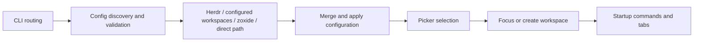

# Contributing

Start here to build and verify a change. The [workspace history](workspace-history.md)
and [benchmark](benchmarks.md) pages explain those subsystems in more depth.

## Set up a checkout

Install Git, Git LFS, and [mise](https://mise.jdx.dev/) before cloning. Herdr is
needed for interactive plugin checks; the unit tests use test doubles.

```bash
git clone https://github.com/fullerzz/herdr-plugin-sesh.git
cd herdr-plugin-sesh
git lfs install
git lfs pull
mise install
just build
```

`mise.toml` pins development tools. `go.mod` declares the minimum Go version;
the development pin can be newer. Use `just` to list repository recipes.

### Link and exercise the plugin

From a Herdr session:

```bash
just install-plugin
herdr plugin action list --plugin fullerzz.sesh
herdr plugin action invoke fullerzz.sesh.open-picker
herdr plugin log list --plugin fullerzz.sesh
```

`install-plugin` rebuilds and links this checkout. Re-run it after changes, then
open a fresh picker. Use the [configuration setup](../config.md#create-your-configuration)
to inspect the config used by the linked plugin.

Local builds embed `git describe` output: the nearest reachable version tag,
commit distance, and hash, with `-dirty` for tracked changes. An exact clean tag
uses the tag alone; without a version tag the hash is used, and without Git
metadata the fallback is `dev`. Release builds use the release version.

## Find the code



| Area | Entry points |
| --- | --- |
| Executable and orchestration | `cmd/herdr-sesh/`, `internal/app/` |
| Native schema, defaults, legacy migration | `internal/config/` |
| Session types and collection | `internal/model/`, `internal/sources/` |
| Native and fzf picker behavior | `internal/picker/` |
| Target resolution and startup | `internal/connect/`, `internal/startup/` |
| Herdr CLI/socket integration | `internal/herdr/` |
| Preview commands and pane reads | `internal/preview/` |
| Cache, history, atomic writes | `internal/state/` |
| Shipped actions, hooks, minimum Herdr version | `herdr-plugin.toml` |

Before changing shared behavior, inspect its callers and focused tests. Keep
command routing in `internal/app` and reusable behavior in its existing package.

## Verify a change

Start with the affected package, for example:

```bash
go test -race -count=1 ./internal/config
```

Then use the checks appropriate to the change:

| Change | Checks |
| --- | --- |
| Go behavior | `just check`, `go vet ./...`, `just build`, then the CLI smoke commands below |
| Documentation | `just build-docs` and inspect the rendered pages with `just serve-docs` |
| Versioning, navigation, or docs build configuration | `just test-docs-versions`, `just build-docs`, `just build-docs-versions` |
| Docs Python scripts | `uv run --frozen ruff check .`, `uv run --frozen ruff format --check .`, plus versioning checks |
| Performance-sensitive behavior | Baseline/candidate comparison from [Benchmarks](benchmarks.md) |

```bash
./bin/herdr-sesh --version
./bin/herdr-sesh list --json --config testdata/herdr-sesh.toml
git diff --check
```

!!! note "What just check includes"

    `just check` runs lint, formatting checks, race-enabled tests, and the release
    ref regression. It does not build the binary or documentation. Run the build
    and smoke checks separately before opening a code PR, and the docs checks
    when documentation changes.

### Test conventions

Place `Test<Behavior>` tests beside the implementation. Use the smallest
regression that fails for the behavior being changed, reusing existing fake
Herdr clients/runners rather than requiring a live session in unit tests.
Keep fixtures in `testdata/`.

Use Testify `require` for prerequisites such as errors, nil values, and lengths
before indexing; use `assert` for independent expectations. Keep `require` on
the test goroutine and return worker errors to it. The linter checks assertion
usage. For interactive changes, also exercise the picker in Herdr, including a
narrow terminal when layout is affected.

## Work on documentation

Edit `docs/` and add navigation entries in `zensical.toml`. `site/` is generated
output. Use the pinned Python environment through `uv`; use `xh` for HTTP
checks and `mise` or `brew` to install tools. Shared tool pins belong in
`mise.toml`.

```bash
just serve-docs
```

Open the address printed by Zensical. Check links, code copying, configuration
tabs, diagrams, and narrow-screen navigation. Admonitions suit important
behavior, tabs separate installed-plugin and checkout commands, and code
annotations explain non-obvious settings. Keep basic instructions visible.

### Versions and deployment

The versioned builder takes `latest` from the current checkout and each eligible
release's docs and config from its exact tag. Published `latest` follows `main`;
snapshots begin at `v0.10.0`. Historical snapshots use the current builder's
Python environment. Their source is not rewritten by edits to `docs/` today.

Before building all versions, fetch tags and historical media:

```bash
git fetch --tags
git lfs fetch --all
just test-docs-versions
just build-docs-versions
```

The builder exports into `site/` without pushing a deployment branch. It keeps
unversioned links working through redirects to `latest`, preserves queries and
fragments, and supplies a root `404.html`. Keep `site_url` unversioned.

The Docs workflow builds and tests PRs; only trusted push/manual runs deploy to
GitHub Pages. A local build confirms generation, not deployment. Check the Docs
workflow and the published URL before reporting a release's docs as live.

“Edit this page” targets `main`; release snapshots disable the edit link.
Use the version selector to return to `latest` before proposing a correction.

## Pull requests and releases

Use Conventional Commit subjects such as `fix: correct picker selection`.
Explain the user-visible change, link its issue when applicable, and list the
validation commands actually run. Include screenshots for visual changes when
they help review.

For maintainers, update `version` and the embedded build version in
`herdr-plugin.toml`, then commit the release preparation to `main`. Set
`GITHUB_TOKEN` for GitHub changelog metadata. From a clean checkout:

```bash
just preview-changelog vX.Y.Z
just release vX.Y.Z
```

The release recipe asks for confirmation, requires a new `v` tag matching the
manifest, runs code checks and CLI smokes, generates the changelog, tags the
release source commit, commits the changelog as a follow-up, and atomically
pushes `main` and the tag. Run the docs gates beforehand; the recipe does not
include them. Verify the release and Docs workflow results after publication.
