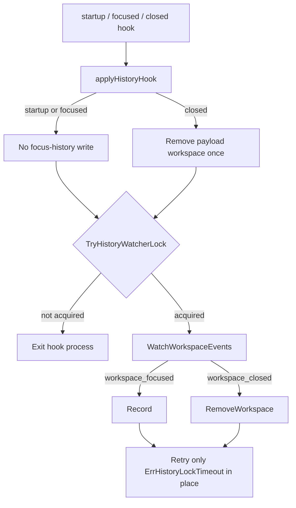
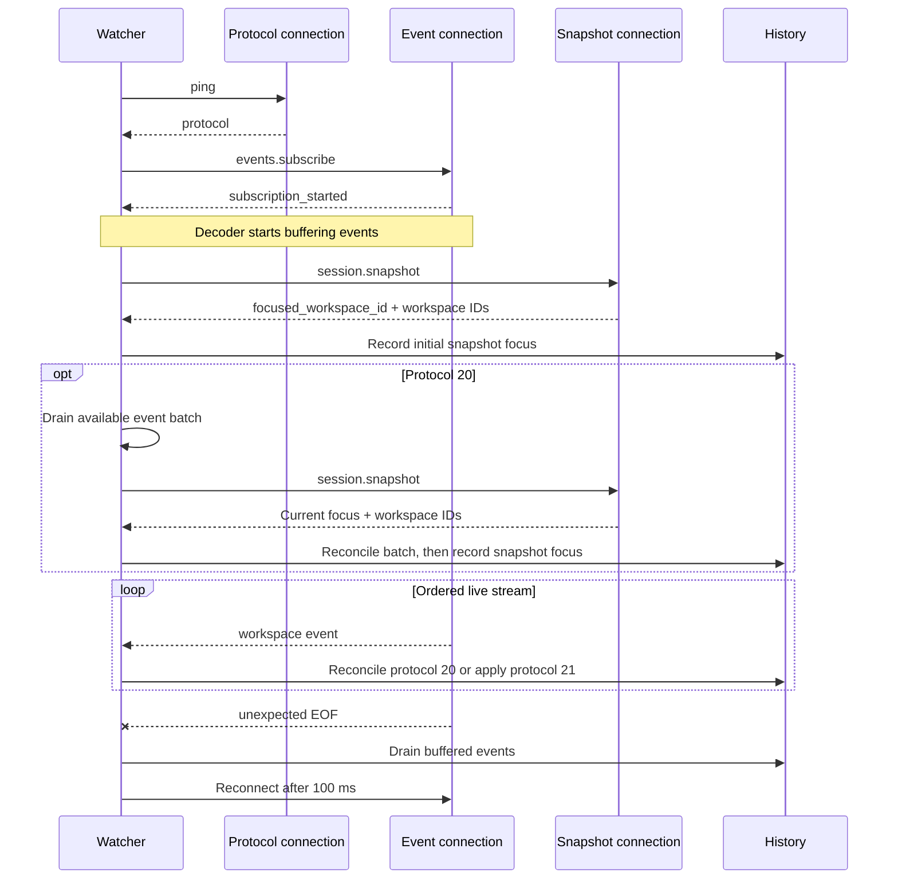
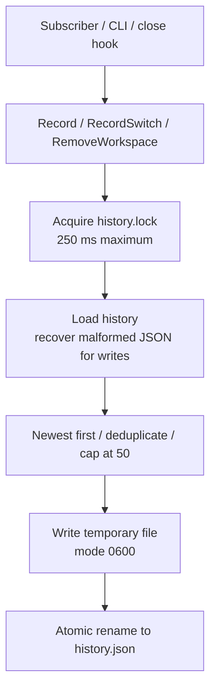

# Workspace history tracking

The `last-workspace-tracking` implementation keeps `herdr-sesh last` and the
picker's previous-workspace marker accurate when focus changes outside the
plugin. Herdr lifecycle hooks elect one long-lived subscriber per socket, and
that subscriber serializes focus and close events into plugin-owned
history.[^watcher-source]

!!! info "Protocol 20 replay is reconciled against current session state"

    The manifest requires Herdr 0.8.2 or newer, whose stable socket protocol is
    20. Protocol 20 replays retained lifecycle events without a completion
    marker, so the watcher reconciles every available event batch with a fresh
    session snapshot instead of inferring a boundary from timing. Protocol 21
    and newer start lifecycle subscriptions at the current event sequence and
    skip that replay step; see the [subscriber implementation](https://github.com/fullerzz/herdr-plugin-sesh/blob/main/internal/herdr/events.go)
    and [protocol regression tests](https://github.com/fullerzz/herdr-plugin-sesh/blob/main/internal/herdr/events_test.go).

## Why a resident subscriber exists

Herdr launches startup and event hooks as separate processes. Those processes
can overlap, so letting every `workspace.focused` hook write history would make
the final file order depend on process scheduling instead of focus order.

The plugin manifest routes three lifecycle triggers to the same hidden command:

| Trigger | Hook behavior | Subscriber behavior |
| --- | --- | --- |
| Startup | Does not mutate history; attempts watcher election. | Establishes the event stream and records the session snapshot. |
| `workspace.focused` | Does not mutate history; attempts watcher election. | Records the focused workspace in stream order. |
| `workspace.closed` | Removes the ID from `data.workspace_id` once, then attempts watcher election. | Removes the same ID if the stream also reports it; removal is idempotent. |

`TryHistoryWatcherLock` uses a socket-derived `flock` file named
`history-watch-<sha256(socket)>.lock`. The winner holds the lock while
`WatchWorkspaceEvents` runs; other hook processes exit. A later lifecycle hook
can elect a replacement if the subscriber stops.

The following diagram maps the production control flow in `internal/app` while
keeping the hook and subscriber responsibilities separate.



## Subscriber bootstrap and event ordering

Each connection attempt follows this order:

1. Call `ping` and reject servers below protocol 20.
2. Open the event connection and subscribe to `workspace.focused` and
   `workspace.closed`.
3. Start decoding events as soon as the subscription acknowledgement arrives.
4. Use a second socket connection to request the initial
   `session.snapshot`.[^snapshot-source]
5. On protocol 20, drain each currently available event batch and request a
   fresh snapshot. Apply focus events only for workspaces that still exist,
   close events only for workspaces that no longer exist, then record the
   snapshot's authoritative `focused_workspace_id`.
6. On protocol 21 and newer, apply the already-buffered and future live events
   directly in decoder order.

Starting the decoder before the initial snapshot request closes the bootstrap
window. The protocol 20 path has no timer or fixed replay cutoff: a delayed
retained event becomes a later batch and is re-anchored to current session
state. The buffer holds 1,024 events. If the stream ends, queued protocol 20
events go through the same snapshot reconciliation before the watcher
reconnects after 100 ms. Herdr subscriptions do not expose a replay cursor, so
events that never reached the client before an unexpected disconnect can still
be lost; the reconnect snapshot restores current focus but cannot reconstruct
that transient order.[^reconnect-gap]

Subscription request names use dotted event types. Incoming event envelopes
use `workspace_focused` and `workspace_closed`; malformed, unrelated, and
ID-less envelopes are ignored.



Regression tests define four boundaries for this flow: reconcile delayed
protocol 20 replay without a timer, preserve queued replay across stream
failure, preserve an event from the snapshot window, and reconnect after
unexpected EOF.

## Session-scoped persistence

`SessionHistoryDir` cleans and hashes `HERDR_SOCKET_PATH` with SHA-256. Each
Herdr session therefore writes to an independent path:

```text
${HERDR_PLUGIN_STATE_DIR}/history/<sha256-clean-socket-path>/history.json
```

Existing unscoped `history.json` belongs to the default Herdr session. It is
copied into that session's scoped directory on first use while holding both the
legacy and destination history locks. Named sessions never inherit the old file.

History mutation has a separate stable lock, `history.lock`. Writers attempt
`LOCK_EX | LOCK_NB` every 10 ms for up to 250 ms. A timeout returns the typed
`ErrHistoryLockTimeout` error.[^flock-source]

- short-lived close hooks make one bounded mutation attempt;
- the resident subscriber retries only this typed timeout in place, preserving
  event order;
- other errors stop the watcher instead of spinning.

`Record`, `RecordSwitch`, `RemoveWorkspace`, migration, and direct saves all
share the same lock boundary. JSON writes go to a temporary file, set mode
`0600`, and atomically rename over `history.json`; state directories use
`0700`.[^persistence-source]



The history list is newest first, deduplicated, and capped at 50 workspace IDs.
`Record` ignores an already-current head. Explicit CLI and picker transitions
use `RecordSwitch(from, to)` so both sides of the switch survive even before a
Herdr event is observed.[^record-switch-source] Closed workspaces are pruned,
and malformed JSON is recovered only at a locked write boundary.

`Last` returns the second entry because the head is the focused workspace.
Code that already knows the current workspace can use `Previous` to select the
first non-current entry.

## Failure model

??? info "Deliberate constraints"

    - The subscriber uses one resident plugin command slot per Herdr socket.
    - Herdr does not supervise the command; the next lifecycle hook performs
      replacement election after a crash.
    - File locking depends on `flock`. Unsupported filesystems fail explicitly.
    - The JSON format and 50-entry cap remain intentionally small; there is no
      database or background compaction layer.

The close-hook payload is authoritative. `HERDR_WORKSPACE_ID` is contextual and
is not used to decide which workspace closed; a missing or malformed
`HERDR_PLUGIN_EVENT_JSON.data.workspace_id` fails safely.

## Verify a change

Run the focused race-enabled suite first, then the repository and docs gates:

```bash
go test -race -count=1 ./internal/state ./internal/herdr ./internal/app
just check
just build-docs
```

The most useful implementation entry points are:

| Area | File |
| --- | --- |
| Hook routing and watcher ownership | `herdr-plugin.toml`, `internal/app/app.go` |
| Herdr protocol and subscription loop | `internal/herdr/events.go` |
| Session paths, locks, and history semantics | `internal/state/history.go` |
| Atomic writes | `internal/state/json.go` |
| Concurrency and protocol regressions | `internal/app/app_test.go`, `internal/herdr/events_test.go`, `internal/state/history_test.go` |

[Watcher orchestration](https://github.com/fullerzz/herdr-plugin-sesh/blob/main/internal/app/app.go){ .md-button }
[Event subscriber](https://github.com/fullerzz/herdr-plugin-sesh/blob/main/internal/herdr/events.go){ .md-button }
[History state](https://github.com/fullerzz/herdr-plugin-sesh/blob/main/internal/state/history.go){ .md-button }

[^watcher-source]: See the lifecycle declarations in
    [`herdr-plugin.toml`](https://github.com/fullerzz/herdr-plugin-sesh/blob/main/herdr-plugin.toml)
    and watcher election in
    [`internal/app/app.go`](https://github.com/fullerzz/herdr-plugin-sesh/blob/main/internal/app/app.go).
[^snapshot-source]: See `loadSessionSnapshot` and the buffered decoder in
    [`internal/herdr/events.go`](https://github.com/fullerzz/herdr-plugin-sesh/blob/main/internal/herdr/events.go).
[^reconnect-gap]: Herdr documents snapshots as reconnect reconciliation, while
    lifecycle subscriptions explicitly do not replay retained events. See the
    [Herdr socket API](https://herdr.dev/docs/socket-api/#session-snapshot).
[^flock-source]: [`syscall.Flock`](https://pkg.go.dev/syscall#Flock) provides the
    process-level advisory lock used by `withHistoryLock` and
    `TryHistoryWatcherLock`.
[^persistence-source]: The lock and state rules are in
    [`internal/state/history.go`](https://github.com/fullerzz/herdr-plugin-sesh/blob/main/internal/state/history.go);
    atomic replacement is in
    [`internal/state/json.go`](https://github.com/fullerzz/herdr-plugin-sesh/blob/main/internal/state/json.go).
[^record-switch-source]: See `RecordSwitch` in
    [`internal/state/history.go`](https://github.com/fullerzz/herdr-plugin-sesh/blob/main/internal/state/history.go)
    and its focused tests in
    [`internal/state/history_test.go`](https://github.com/fullerzz/herdr-plugin-sesh/blob/main/internal/state/history_test.go).
